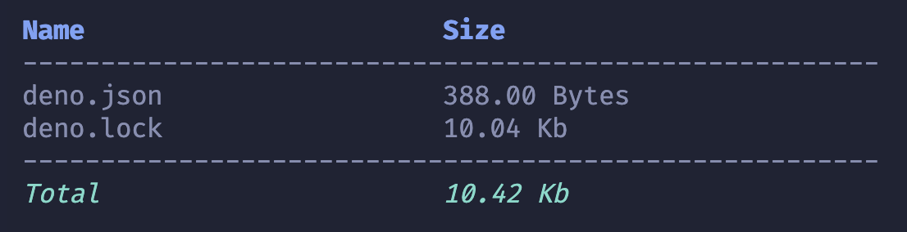

# Dyr

Command line to list files on terminal.

### How to install

```
deno install --global --allow-read --allow-env jsr:@rkvcs/dyr
```

### How to use

```
dyr <option>

Options:
    -h               - Show this help.
    -v               - Show the version number for this program.
    -s <term>        - Find files or folders by name
    -d               - List only directories
    -f               - List only files

```
#### ---

